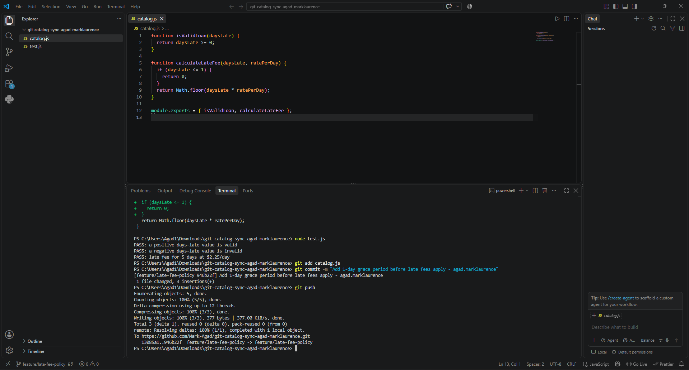
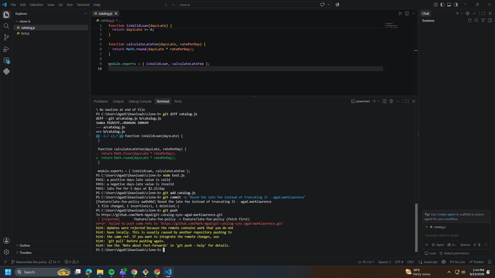
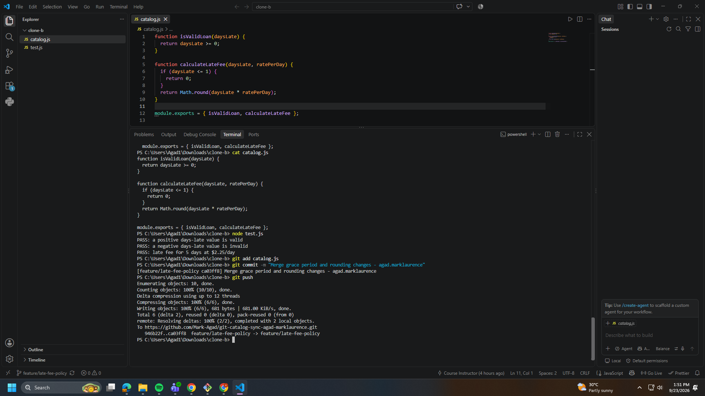
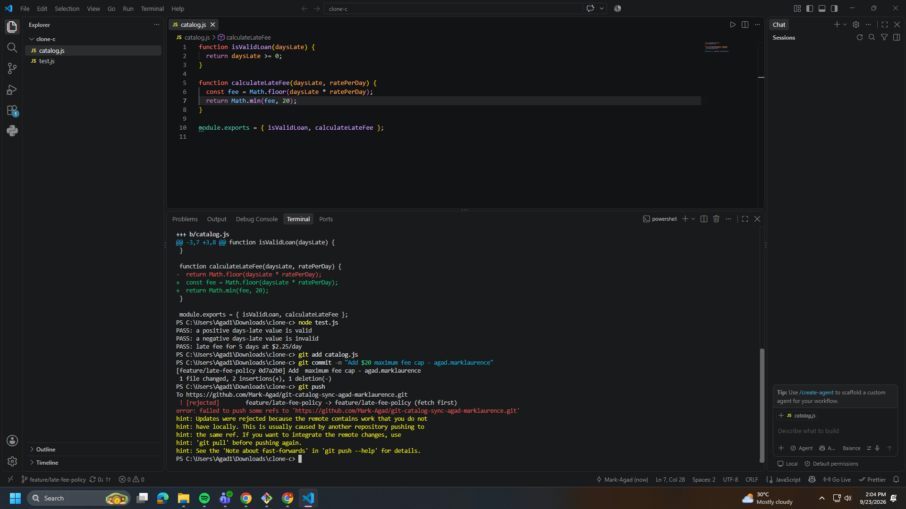
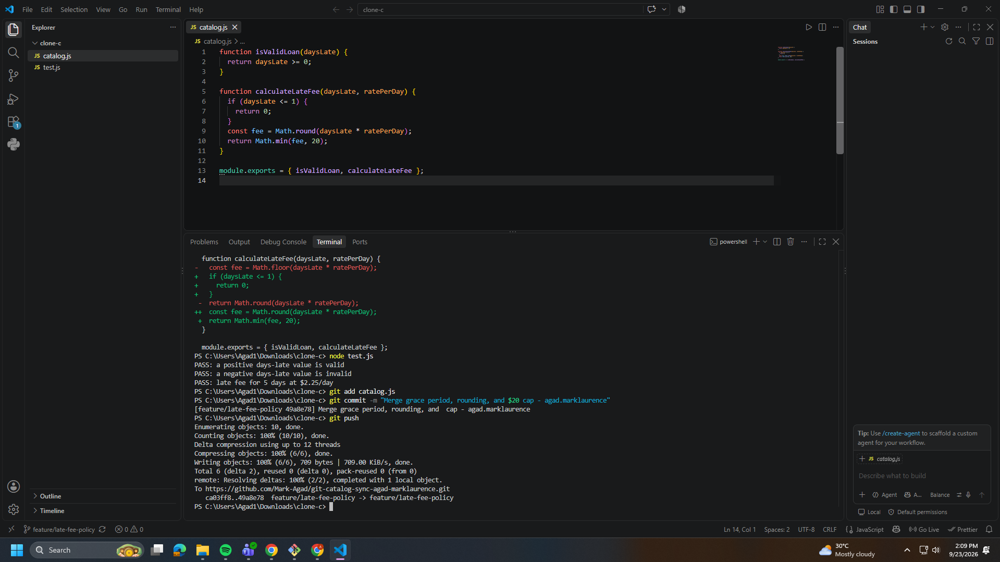
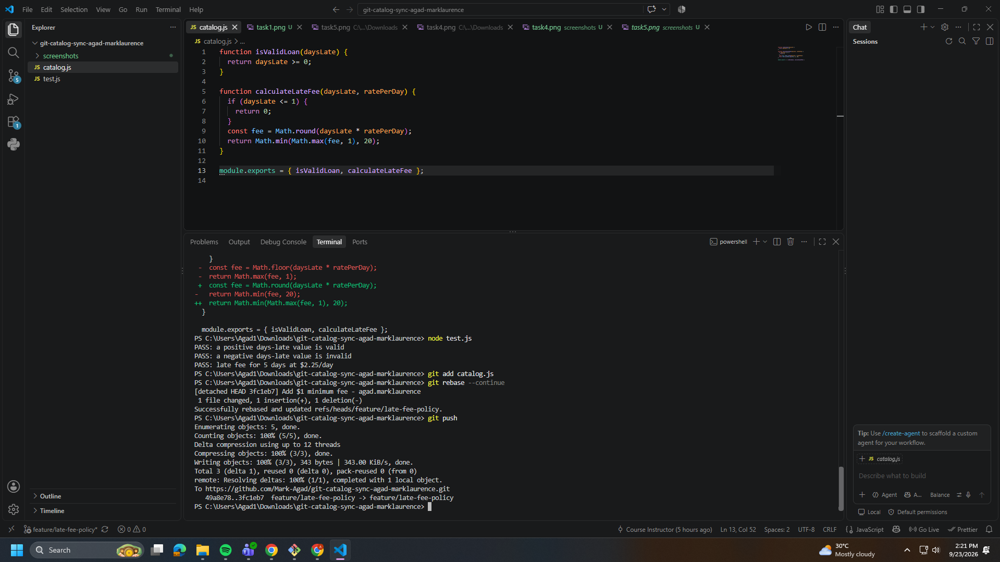
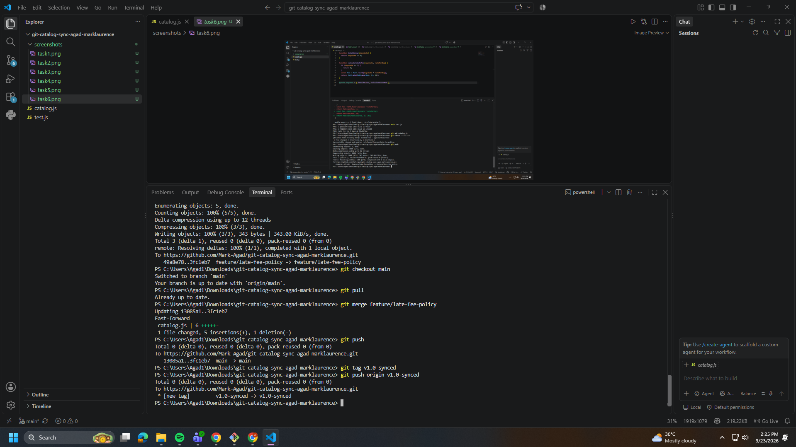

## Task 1: grace period committed and pushed from Clone A:

## Task 2: conflicting change committed in Clone B, push correctly rejected: 

## Task 3: first merge conflict resolved correctly, both behaviors present, tests pass, pushed:

## Task 4: third-contributor change committed in Clone C, push correctly rejected:

## Task 5: three-way merge conflict resolved correctly, all three behaviors present, tests pass, pushed: 

## Task 6: rebase conflict resolved correctly, all four behaviors present, tests pass, pushed without force:

## Task 7: merged into main, tagged, pushed:

## 1.Walk through the final calculateLateFee function and name which contributor's change is responsible for each part.

function calculateLateFee(daysLate, ratePerDay) {
  if (daysLate <= 1) {
    return 0;
  }
  const fee = Math.round(daysLate * ratePerDay);
  return Math.min(Math.max(fee, 1), 20);
}

The first part, if (daysLate <= 1) { return 0; }, is the grace period I added in Task 1 from Clone A. It means if someone is only 0 or 1 day late, they don't get charged anything.

The next part, Math.round(daysLate * ratePerDay), comes from Task 2 in Clone B. Before this, the fee was calculated using Math.floor, which just cuts off the decimal. This change rounds it instead, so the fee is more accurate.

The Math.max(fee, 1) part is from Task 6, which I added back in Clone A. This makes sure the fee is never less than $1, even if the calculated amount comes out really small.

Last, Math.min(..., 20) is from Task 4 in Clone C. This caps the fee so it never goes above $20, no matter how late the item is.

## 2: Compare Task 3's two-way conflict to Task 5's three-way conflict — what got harder with a third line of work?

In Task 3, there were only two versions of the code fighting for the same lines — my grace period from Clone A, and the rounding change from Clone B. It was pretty easy to see what each side changed and just combine them.

In Task 5, there were three versions all touching the same function at once — the grace period, the rounding, and now the $20 cap from Clone C. It got harder because I had to make sure all three changes worked together in the right order, not just pick pieces from two sides. I also had to think more carefully about the order of operations, since if I put the cap before the rounding, or the grace period after the calculation, the logic would break.

## 3. What's the actual difference between how you resolved Task 5 (merge) and Task 6 (rebase)?

In Task 5, I used git merge, which took my current branch and the incoming branch and combined them into a brand new commit. That merge commit sits on top of both histories and has two parent commits.

In Task 6, I used git fetch and git rebase instead. Rebase didn't create a merge commit. Instead, it took my one commit (the $1 minimum fee) and replayed it on top of the latest version of the branch, like I had made that change after everyone else's work instead of before. This kept the history looking like a straight line instead of having a branch-and-merge shape. Because of this, when I pushed at the end, it counted as a normal push instead of needing to force it.

## 4. If this were a real team of three, what one process change would have prevented all three rejected pushes?

If we always ran git fetch and git pull before starting any new work, we would have caught the other person's changes early instead of finding out only when we tried to push. A simple habit like "pull before you start working, and pull again before you push" would have stopped all three rejections, since each one happened because someone was working off an old version of the branch without checking for updates first.